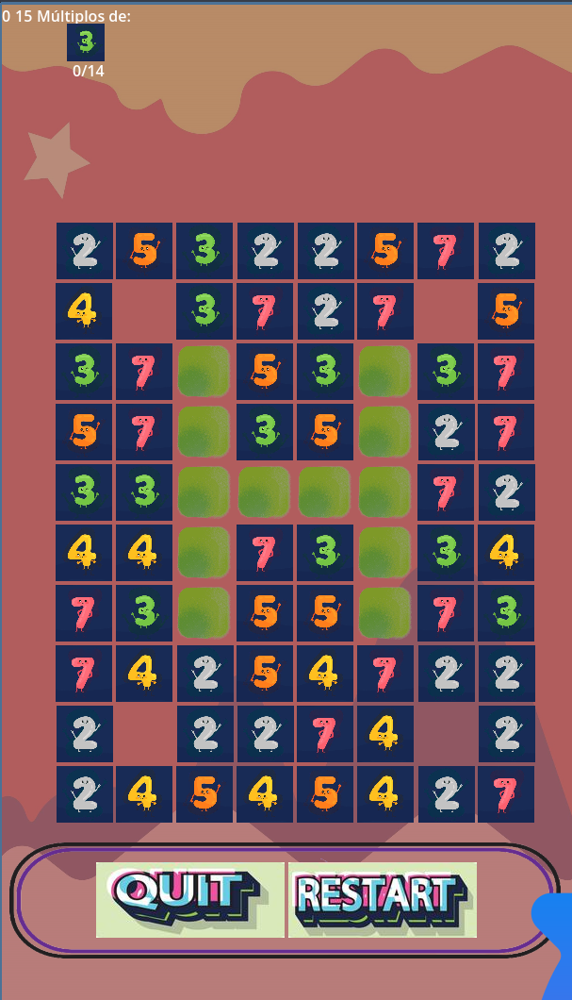
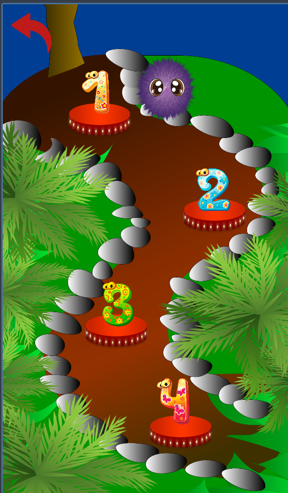

# Play-To-Fail: Jugando con Números

 
*(Nota: Asegúrate de tener las imágenes en la ruta correcta)*

## 🎮 Acerca del Juego
**Play-To-Fail** es un juego educativo de rompecabezas tipo "Match-3" desarrollado en **Godot Engine**. El objetivo principal es juntar números que sean múltiplos entre sí, desafiando el conocimiento matemático de los jugadores (principalmente estudiantes) de una manera divertida y dinámica.

### Capturas de Pantalla
| Menú Principal | Nivel de Juego |
| :---: | :---: |
|  |  |

## 🚀 Características Principales
- **Mecánica Educativa**: Aprende y practica múltiplos mientras juegas.
- **Múltiples Obstáculos**: Lodo (slime), bloques, concreto y cerraduras que añaden profundidad estratégica.
- **Potenciadores**: Sistema de bombas (filas, columnas y adyacentes) para limpiar el tablero.
- **Persistencia de Datos**: Sistema de guardado para configuraciones y progreso.
- **Base de Datos Local**: Integración con SQLite para gestionar usuarios y puntuaciones.

## 🛠️ Tecnologías Utilizadas
- **Motor**: Godot Engine 4.x
- **Lenguaje**: GDScript
- **Base de Datos**: SQLite (mediante el plugin `godot-sqlite` para Godot 4)
- **Gráficos**: Assets 2D personalizados (ver carpeta `art/`).

## 📥 Instalación y Configuración
1. **Clonar el repositorio**:
   ```bash
   git clone https://github.com/AARCOF/Play-To-Fail-Juego-en-Godot.git
   ```
2. **Abrir en Godot 4**:
   Importa el archivo `project.godot` en el Godot Engine Editor.
3. **Configuración de SQLite**:
   Este proyecto requiere el plugin `godot-sqlite` version Godot 4. Asegúrate de que esté habilitado en `Ajustes del Proyecto > Plugins`.

## 👥 Equipo de Desarrollo
Somos un grupo de estudiantes apasionados por la informática que buscamos crear herramientas educativas innovadoras. Este proyecto nació del esfuerzo colectivo y el deseo de aprender profesionalmente en el desarrollo de videojuegos.

### Master del Proyecto
- [AARCOF](https://github.com/AARCOF)

## 📄 Documentación Detallada
Puedes encontrar la documentación completa del diseño y desarrollo en el siguiente enlace:
[Documento de Diseño (Google Docs)](https://docs.google.com/document/d/1doSqkgT_fuinrmi0Y-i7vmSZcq0UZAd02rZE72L7lLA/edit)

---
*Hecho con ❤️ para la comunidad estudiantil.*
